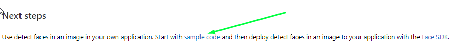

<h1 align ='center'> <strong>Machine Learning of Regression<strong> </h1>

Exprerimento realizado como desafio de aprendizagem no Bootcamp Microsoft Azure AI Fundamentals da [DIO](https://dio.me). 
seguindo a documentação oficial da Microsoft Azure AI Vision nesse [link](https://learn.microsoft.com/en-us/azure/ai-services/computer-vision/).

## **Passo a passo**

- [1. Criando Recurso](#1-criando-recursos)
- [2. Vision Studio ](#2-vision-studio)
- [3. Face detect](#3-face-detect)
- [4. Optical character recognition](#4-reconhecimento-óptico-de-caractere)
- [5. Add captions to images ](#5-add-captions-to-images)
- [6. Resumo](#6-resumo)

 

---
## **1. Criando Recurso**

- Primeiramente é necessário estar logado no Microsoft Azure. Se acaso ainda não tiver uma conta no Azure faça por esse [link](https://azure.microsoft.com/pt-br/free), clicando em "Experimente gratuitamente".

- Após o Login, no menú lateral clique em "Create a Resourse" como na imagem a seguir.

 

 

- Em seguida na aba categorias soleciona a opção "AI + Machine Learning" como na imagem a seguir.

 

 

- Ache a opção "Azure AI services" e clique em Create como na imagem a seguir e siga a configuração da imagem a subsequente.

 

 

 

- Clique em "Review + Create" e após o processo de review clique em "Create" e aguarde a finalização do processo e aparecera uma confirmação como na imagem a seguir.

 

 

[ Back to the top ](#passo-a-passo)

---

## **2. Vision Studio**
 
- Para acessar o portal do Vision Studio acesse esse [link](https://portal.vision.cognitive.azure.com).

- Faça login se necessário e clique em "View all resources" como na imagem a seguir.

 

 

- Selecione o projeto criado no passo anterior e clique em "Select as default resouce" como na imagem a seguir.

 

 

- Após volte a home do portal clicando em "Vision Studio" no topo da tela.

[ Back to the top ](#passo-a-passo)

 

---

## **3. Face detect**

- Na tela inicial do portal "Vision Studio" localize a aba "Face" e clique nela, como na imagem a seguir.

 

 

- Em seguida clique no card "Detect faces in an image" conforme a imagem abaixo.

 

 

- Marque a "check box" conforme a imagem abaixo. 

 

 

- Em seguida selecione qualquer uma das imagens de demonstração para o algoritmo poder identificar o rosto na imagem. Detalhes na imagem a seguir. E na sequência como fica o resultado com as coordenadas dos detalhes de cada rosto em JSON.

 

 

 

- Para verificar como ficaria a implementação desta ferramenta no seu código siga o "Next steps", como na imagem.
 

 

- Como um último teste fiz o upload da minha foto de perfil da DIO para ver testar, e para o susto de quem estiver vendo esse tutorial, deu certo.

 

 

[ Back to the top ](#passo-a-passo)

---

## **4. Reconhecimento óptico de caractere**

- Na tela inicial do portal "Vision Studio" localize a aba "Optimal character recognition" e clique nela, como na imagem a seguir.

 

 

- Selecione alguma das imagens com textos para testar as formas de reconhecimento de caracteres.

- Fiz dois testes uma com textos de placas e outra com texto de letra cursiva, tentei fazer um garrancho (e consegui) mas mesmo assim a inconsistência foi mínima, veja nas imagens.

 

 

 

[ Back to the top ](#passo-a-passo)

---

## **5. Add captions to images**

- Na tela inicial do portal "Vision Studio" localize a aba "Image analysis" e clique nela, como na imagem a seguir.

 

 

- Selecione ou carregue alguma imagem para ser analizada e transcrita. Eu selecionei uma aleatoria da internet e obtive esse resultado.

 

 

## 6. **Resumo**

- Vimos neste projeto 3 testes de analize de imagens com rostos, imagens com textos e com objetos e todos tiveram bons resultados inclusive um texto cursivo com letras exóticas. 
Para maiores informações consultar a documentação oficial Microsoft Azure Vision Studio. 

[ Back to the top ](#passo-a-passo)

---

    

 